# CS6140 Project 2: K-NN, PCA, and Clustering

## Dependencies

The open source packages used in this project include:

    plotly
    pandas
    numpy
    scipy
    sklearn

Also, included here are the helper modules we have built for this project:

* `nearest_neighbor`: our own implementation of K nearest neighbor clustering 
* `cluster_quality` : calculates clustering quality with metrics including Rissannon Minimum Description Length, Krzanowski and Lai, or Ray and Turi
* `distance`: calculates distance between a vector and a set of vectors

A full list of requirements can be found [here](https://github.com/bronteee/machine-learning-projects/blob/main/mlprojects/requirements.txt).

## Setup and Running Executables

All analysis in this project are conducted in `project2.ipynb`, which can be run directly in Jupyter Notebook.
To render plots produced by `plotly`, use:

    import plotly.io as pio
    pio.renderers

For more details, visit [this plotly page for displaying figures in Python](https://plotly.com/python/renderers/).

The PDF report for this project is created from README.md using

    pandoc README.md -o project2_report.pdf "-fmarkdown-implicit_figures -o"
    --from=markdown -V geometry:margin=.8in --toc --highlight-style=espresso

## Introduction
One of the most important applications of machine learning is in medical research where it becomes extremely helpful to predict clinical outcomes based on test results and measurements.

In this project, we will work with a dataset from the UCI Machine Learning repository from measuring liver markers thought to be affected by alcohol consumption and apply PCA and clustering methods to predict the target variable, number of alcoholic beverages drunk per day.

* [Liver Disorders. (1990). UCI Machine Learning Repository.](https://archive-beta.ics.uci.edu/dataset/60/liver+disorders)

Another data set we will analyze is the activity recognition data set:
* [UCI Activity Recognition Data Set](https://archive.ics.uci.edu/ml/datasets/human+activity+recognition+using+smartphones)

## Methods

### Convert Continuous Target to Discrete Values
In order to perform clustering and evaluate the results for the liver disorder dataset, we need to first convert to continuous target variable to discrete values.
Here is what our target distribution looks like:

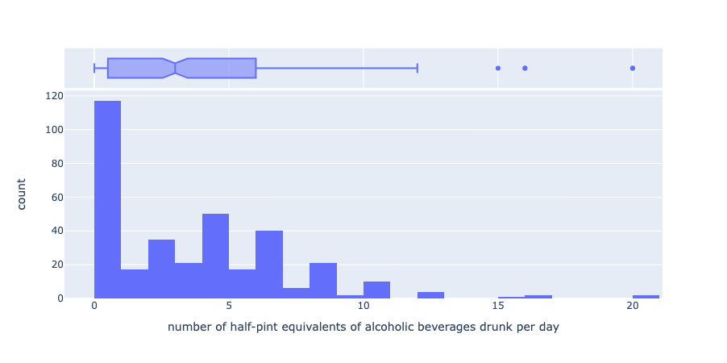

We do this by calculating the optimal histogram bin edges and applying the bin cuts to our target column. Here is the result:

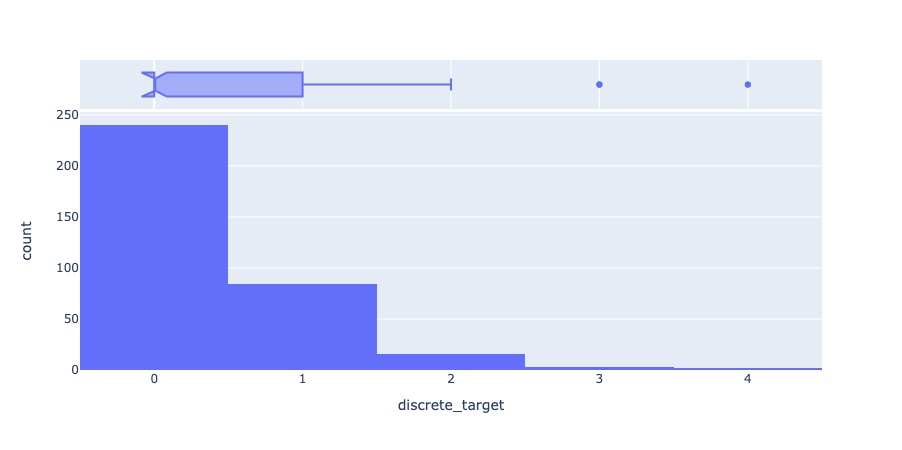

### Distance Metric

In `distance.py`, there are a few implementations of the most common distance metrics in machine learning for numeric values:

* Euclidean: 
  
The formula for Euclidean distance is:

When calculating the Euclidean distances for every vector between two matrices, we can simplify the equation for the distance matrix to:

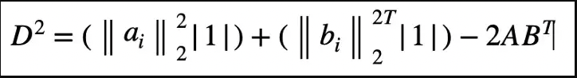

As all of our features for the liver disorder data set are numeric, we choose the Euclidean formula as our distance metric.

* Cosine

Give two vectors A and B, We can visualize the angle between them as theta:

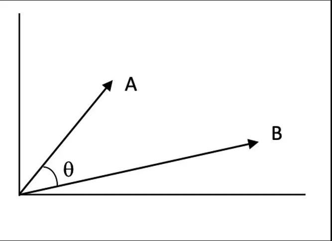

As the name suggests, the cosine distance between two vectors are calculated as follows:

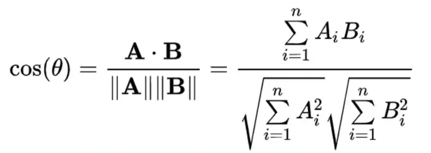

* Minkowski

With Minkowski distance we can define the order, p, and calculate the distance as:

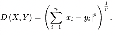

When p=1, this corresponds to the Manhattan distance and when p=2, this is the same as Euclidean distance.

## Results

### Implement Nearest Neighbor Classification

Now, we will implement the nearest neighbor classifier from our helper utility module `nearest_neighbor`.
First, we set the number of neighbors to use (k) as 1.
The result accuracy is

    Accuracy: 0.5977011494252874

To take a further look at how our classifier did, we can compute the confusion matrix and plot it as a heatmap:

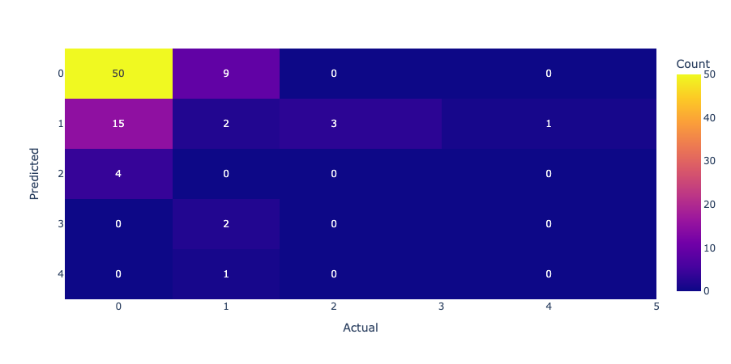

As we can see from the results above, the accuracy is not great - the classifier only got about 60% of the values correct.

Now, what if we increased the number of neighbors we can take into account?
After setting the k value to 5, our accuracy and confusion matrix:

    Accuracy: 0.7241379310344828

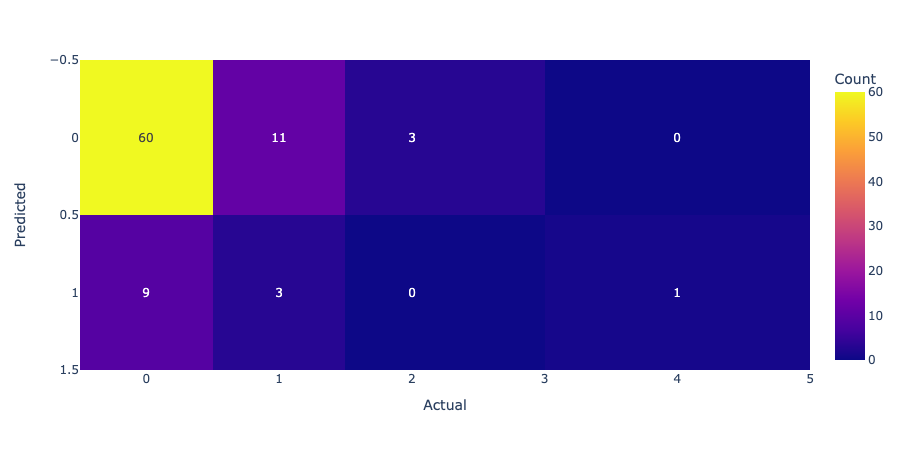

Now, our accuracy is up to 72%, which is quite a big increase. By using more than one nearest neighbor, we do end up having to do more computation by counting the votes for each class for the k neighbors, however, this does allow the classifier to perform a lot better.

### Clustering and PCA on Two Structured Data Sets

Using two structured data sets, explore finding the optimal number of clusters in a data set, how PCA project can affect clustering, and how different clustering algorithms perform on the same data.

We can visualize the data sets and look for natural clusters using a scatter plot:

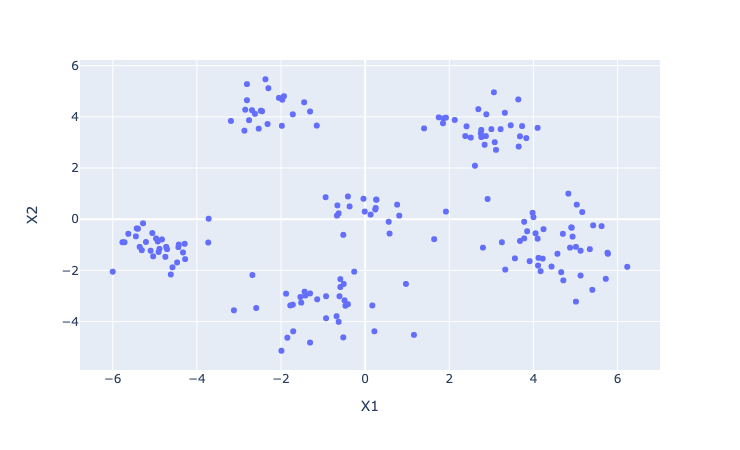
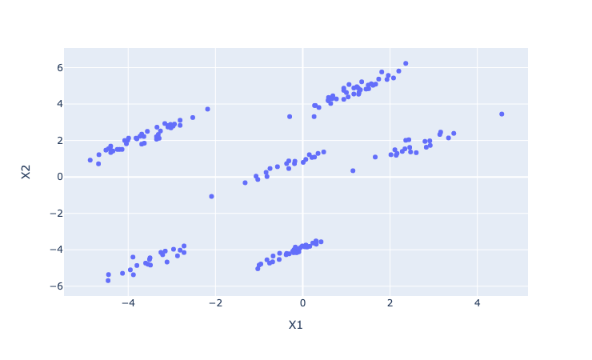

From these graphs one can hypothesize that each of the two data sets have about 6 distinct clusters where data points are close together.

To test this theory, we apply the k-means clustering algorithm and color each point by their cluster label:

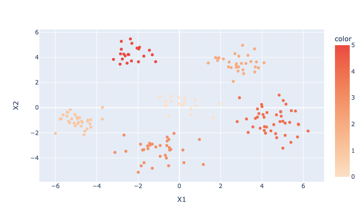
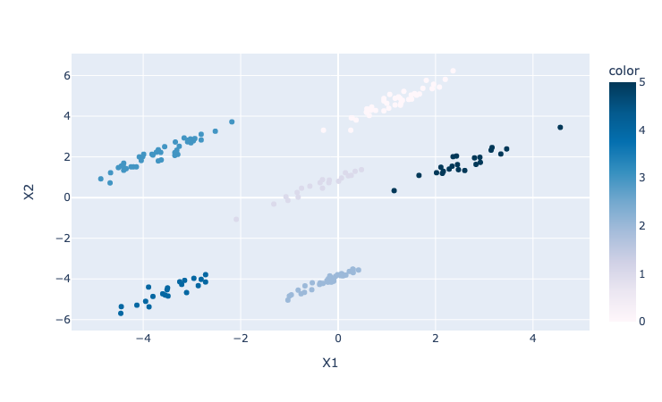

Now we apply a different type of cluster algorithm, complete linkage, a method of hierarchical cluster analysis,  to see if the results might be different.

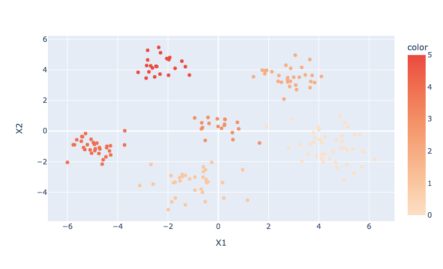
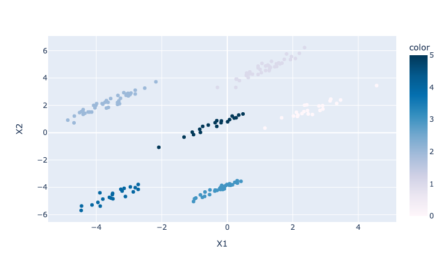

As we can see, the grouping of data points are largely the same, however, the output cluster labels are very different between the two clustering methods. This corresponds with the difference in how the algorithms find the clusters: hierarchical clustering starts with a root cluster and branches out; whereas k-means clustering initializes cluster means and adjusts clustering based on the updated means.

### Compare Different Number of Clusters

How do we know how many clusters to choose for our data? One way to evaluate our clustering is by looking at the representation error with a range of k.
In this section, we compare different values of k and compute the representation error.

Here is the resulting SSE (Sum Squared Error) from a k value ranging from 2 to 1 for data set A:

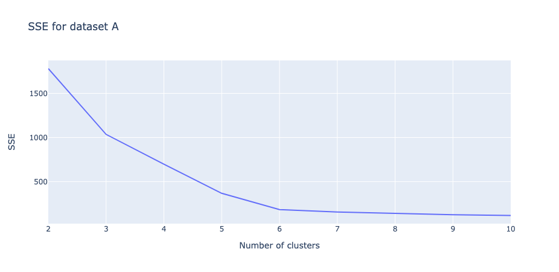

Now we can visualize the cluster quality metric (Ray-Turi) as well:

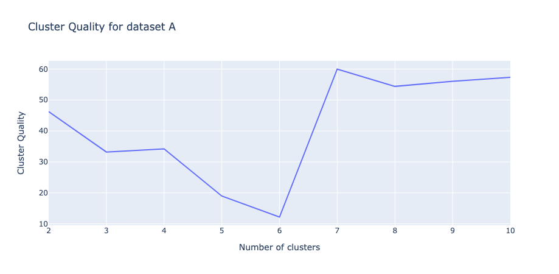

From the two graphs it is easy for us to tell that k=6 is the optimal number of clusters.

### Apply PCA to Example Data

To further analyze, we apply PCA to our example data and visualize the first eigenvector for each data set:

Result for data set A:

    Mean: [0.23       0.08988889]
    Standard Deviation: [3.44805017 2.72489775]
    Eigenvalues: [1.09553917 0.91563402]
    Eigenvectors: 
    [[ 0.70710678  0.70710678]
    [ 0.70710678 -0.70710678]]

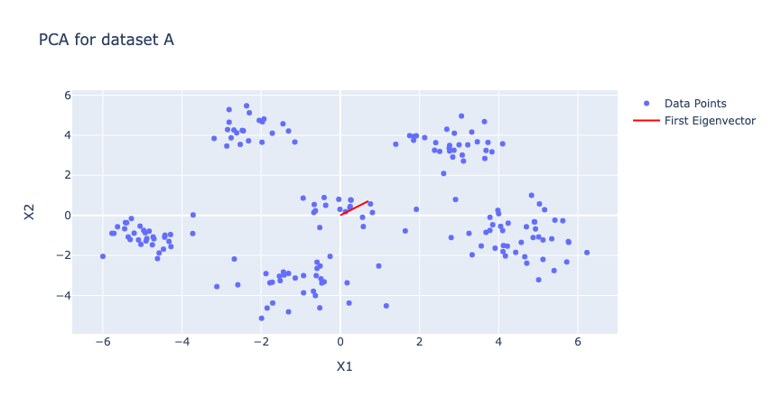

Result for data set B:

    Mean: [-0.75455556  0.50227778]
    Standard Deviation: [2.32178531 3.50371816]
    Eigenvalues: [1.33428193 0.67689125]
    Eigenvectors: 
    [[ 0.70710678  0.70710678]
    [-0.70710678  0.70710678]]

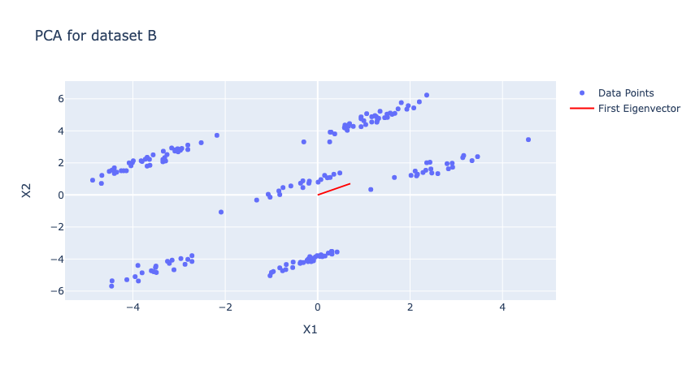

The direction of the eigenvector makes sense as it points out the direction of the most variance in our data set, which is more apparent in the graph for data set B.

### Re-cluster Using Projected Data

Using projected data from PCA, we will now perform clustering again with both k-means and complete linkage.

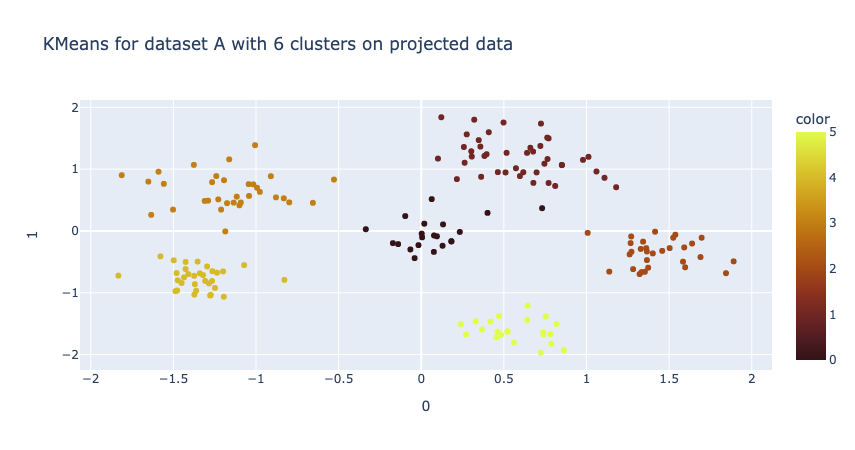
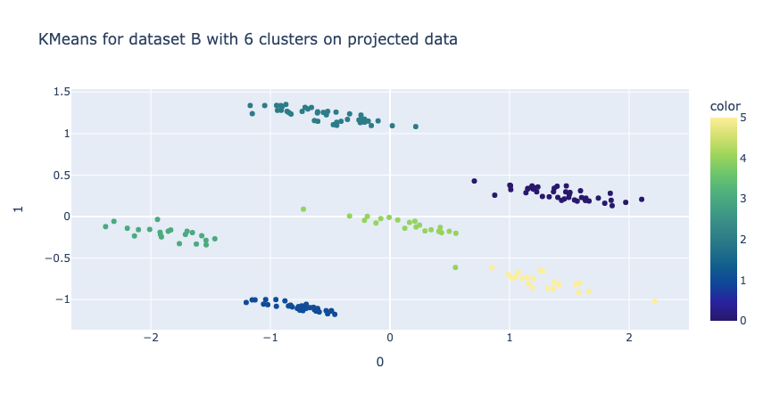

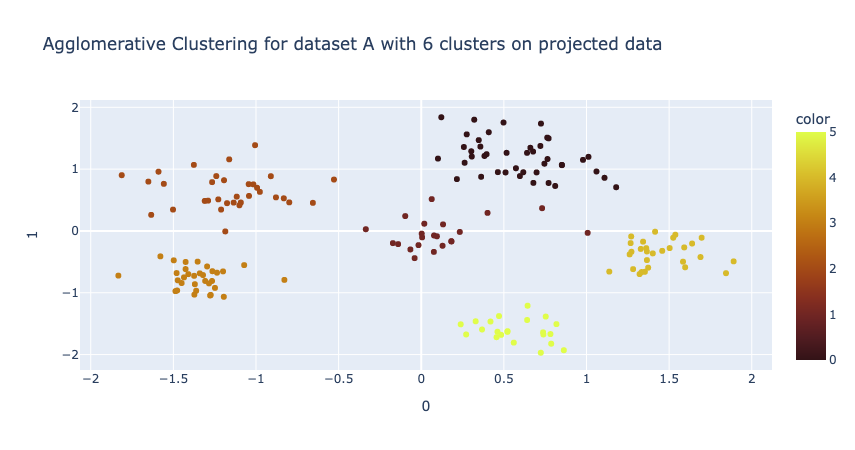
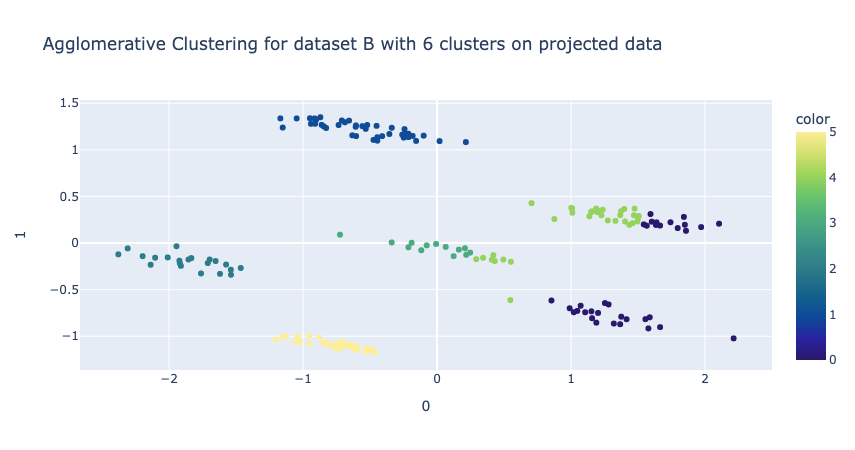

Comparing the results, with k-means clustering on the projected data, the clusters became more distinct; on the other hand, PCA did not improve the clustering for complete linkage.

## Applying K-Means to The Liver Disorder Data

Now we will apply K-means clustering to the liver disorder data. First, we use PCA on the dataset and plot the data projected on 3 dimensions using a 3D scatter plot.

    Mean: [90.26744186 69.93023256 29.79844961 24.59302326 38.50775194]
    Standard Deviation: [ 4.52321596 17.15306651 18.47452881 10.01051142 39.73899753]
    Eigenvalues: [2.29249695 0.97198351 0.92816507 0.55450711 0.27230261]
    Eigenvectors: 
    [[-0.23404322 -0.22746188 -0.54525691 -0.58300473 -0.50624624]
    [-0.81250145 -0.41913017  0.3496958   0.20006706 -0.04309662]
    [-0.46141344  0.87656152 -0.03040711 -0.01298116 -0.13283235]
    [ 0.26215636  0.02755323  0.39846119  0.24412776 -0.84388694]
    [ 0.05862461  0.0589213   0.64862303 -0.74853976  0.10985364]]

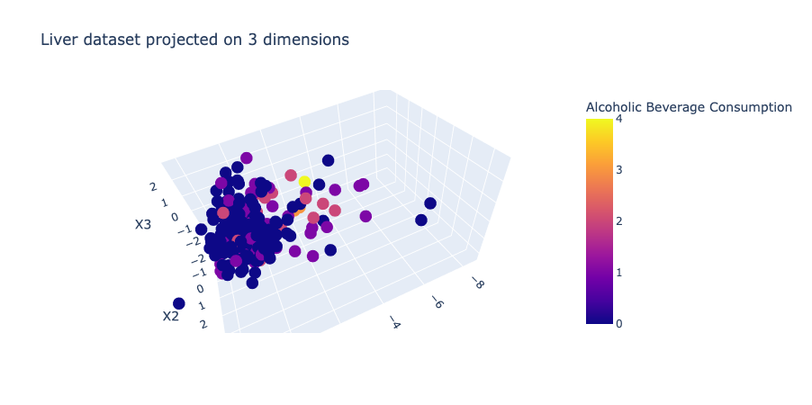

From the graph above, we can see that our data does not appear to have distinct natural clustering and tends to be noisy. We attempt to do further analysis with k-means clustering and DBSCAN.

We iterate through a range of k values and plot the cluster quality metrics:

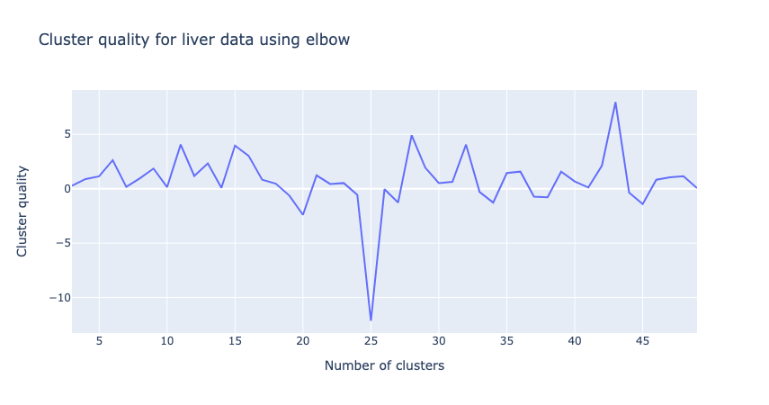
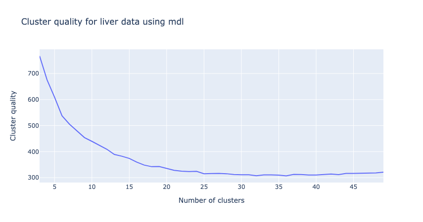
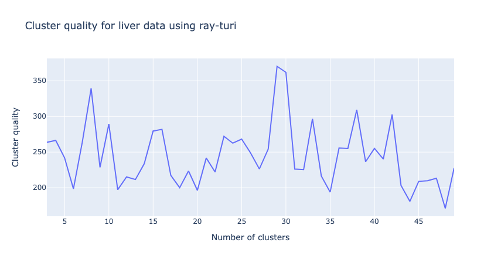

The elbow metric shows a dip at k=25, while from the other two metrics, it is not apparent if there is a best number of clusters. This may indicate that our data does not have any natural clusters, which corresponds with the earlier graph.

We will attempt clustering with another algorithm, DBSCAN, which is density based and does not require us to define the number of clusters.

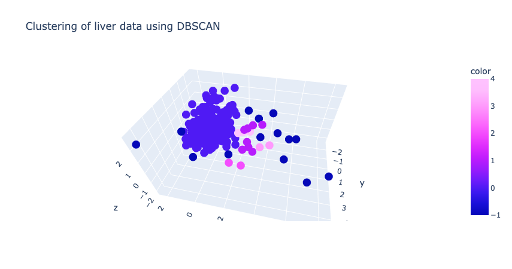

To evaluate the clustering, we compute a few of the quality scores from `sklearn`:

    Homogeneity: 0.09817436598216324
    Completeness: 0.15881833206823637
    Adjusted Rand Index: 0.15871440279491728

Still, these scores tell us that the clustering is not of high quality.

### Use K-Nearest Neighbor and PCA to classify activity from phone measurements

Finally, using the UCI activity recognition data set, we train two K-Nearest Neighbor classifiers before and after PCA and compare their performance.

Result from the KNN classifier using raw data:

    training score: 0.9801916105644743
    test score: 0.9681553398058252

To allow us to transform the data using PCA and adjust the number of dimensions based on the percentage of variance explained, we added another layer of implementation in `pca`:

    eigen_sum = np.sum(self._eigenvalues)
        if n_components < 1:
            threshold = n_components
            n_components = 0
            percent_variance = 0
            while percent_variance < threshold:
                percent_variance += self._eigenvalues[n_components] / eigen_sum
                n_components += 1

Result after PCA with dimensions explaining >= 90% of the variance:

    training score: 0.9712584153288452
    test score: 0.9495145631067962

With both KNN models, we have achieved relatively high accuracy, which means that KNN may be a suitable algorithm for predicting the target variable in this data set. As expected, when only keeping 90% of the variance, we lose some accuracy in the performance.

## Reflection

In this project, we performed a deep dive into clustering methods, nearest neighbor for classification, distance metrics, and cluster quality metrics. Here are a few takeaways:

* Most important distance metrics in machine learning include Euclidean distance, cosine distance, Minkowski distance, and Hamming distance (for text, etc.)
* Increasing the k value for K-nearest-neighbor may increase the performance of the classifier
* Major clustering methods include K-means clustering, hierarchical/agglomerative clustering, and desity based spatial clustering, each of them may be used depending on the nature of the data.
* Not all data have natural clusters and/or are suited for clustering
* PCA is a very useful tool for revealing structure of the data
* There a variety of ways to evaluate clustering quality, i.e. by looking for the elbow of the representation error graph, by balancing the number of bits needed to encode the model, and by calculating the ratio of intra- and inter- clustering distances.

## Extensions

* Implemented 3 different distance metrics in `distance.py`: Euclidean, cosine, and minkowski
* Applied additional clustering method, DBSCAN, for analyzing liver disorder data
* Implemented 3 different clustering quality metrics in `cluster_quality.py`: elbow, MDL, and Ray-Turi.

## References

1. Charles Elkan. 2003. Using the triangle inequality to accelerate k-means. In Proceedings of the Twentieth International Conference on International Conference on Machine Learning (ICML'03). AAAI Press, 147–153. https://www.aaai.org/Papers/ICML/2003/ICML03-022.pdf
2. https://www.analyticsvidhya.com/blog/2020/02/4-types-of-distance-metrics-in-machine-learning/
3. https://en.wikipedia.org/wiki/Chebyshev_distance
4. https://medium.com/swlh/euclidean-distance-matrix-4c3e1378d87f
5. https://www.dabblingbadger.com/blog/2020/2/27/implementing-euclidean-distance-matrix-calculations-from-scratch-in-python
6. https://medium.com/@muhammadammarabid01/k-nearest-neigbors-knn-basic-algorithm-from-scratch-in-python-8471b655a013
7. https://machinelearningmastery.com/distance-measures-for-machine-learning/
8. https://www.fmrib.ox.ac.uk/datasets/techrep/tr00mj2/tr00mj2/node24.html#:~:text=For%20the%20method%20proposed%20here,%3D%20n%20(IQR)%2F100.
9. http://www.jtrive.com/determining-histogram-bin-width-using-the-freedman-diaconis-rule.html
10. Ray, Siddheswar & Turi, Rose. (2000). Determination of Number of Clusters in K-Means Clustering and Application in Colour Image Segmentation. Proceedings of the 4th International Conference on Advances in Pattern Recognition and Digital Techniques (ICAPRDT'99). 1.
11. https://www.statology.org/confusion-matrix-python/
12. https://towardsdatascience.com/cosine-similarity-how-does-it-measure-the-similarity-maths-behind-and-usage-in-python-50ad30aad7db
13. https://en.wikipedia.org/wiki/Minkowski_distance

## Data Source
1. Liver Disorders. (1990). UCI Machine Learning Repository. https://archive-beta.ics.uci.edu/dataset/60/liver+disorders
2. https://archive.ics.uci.edu/ml/datasets/human+activity+recognition+using+smartphones