Copyright © 2023 "Bronte" Sihan Li

## Dependencies
This project has the following requirements:

    pandas
    matplotlib
    plotly
    seaborn
    sklearn
    prince

## Setup and Running Executables

All analysis in this project are conducted in `project3.ipynb`, which can be run directly in Jupyter Notebook.
To render plots produced by `plotly`, use:

    import plotly.io as pio
    pio.renderers

For more details, visit [this plotly page for displaying figures in Python](https://plotly.com/python/renderers/).

The PDF report for this project is created from README.md using

    pandoc README.md -o project2_report.pdf "-fmarkdown-implicit_figures -o"
    --from=markdown -V geometry:margin=.8in --toc --highlight-style=espresso

## Introduction

In this project, we will combine all the knowledge learned from previous lessons and implement some classic machine learning techniques to perform two-class classification on the heart disease prediction dataset.

## Pre-processing, Data Mining, and Visualization

### Variables as Input Features

We plan on using all the independent variables as input features to begin with.
As we can see from the output of value ranges of each variable, we have a mixture of numerical and categorical features:

    Age [66 65 63 58 54 38 51 62 55 52 46 60 59 36 43 41 47 49 45 53 40 61 57 64
    69 74 75 33 56 35 39 37 50 32 42 76 28 34 72 71 48 44 70 30 67 68 31 77
    29]
    Sex ['F' 'M']
    M    575
    F    143
    Name: Sex, dtype: int64
    ChestPainType ['NAP' 'ASY' 'ATA' 'TA']
    ASY    389
    NAP    154
    ATA    136
    TA      39
    Name: ChestPainType, dtype: int64
    RestingBP [146 150 136 192 105 100 130 110 140 120 115 112 155 134 125 160 106 200
    142 154 145 104 156 135  80 148 122 118 124 137  95 152 132 126 131 172
    128 170 138 133 114 174 180 108 141 144 101 139 178 190 165 158 143  92
    123  96 102 164 127 117 113   0 185]
    Cholesterol [278 235 223 164 283   0 213 224 203 214 100 230 284 293 169 308 204 267
    315 268 211 271 253 237 212 246 264 254 240 177 186 210 247 276 231 338
    303 216 208 173 201 310 298 274 192 225 289 219 160 207 185 281 341 245
    282 295 257 197 312 132 233 221 238 417 152 297 199 184 161 123 180 412
    262 306 232 342 159 258 458 249 327 181 209 260 166 248 266 141 222 234
    182 218 318 564 518 316 294 275 242 299 286 190 226 335 239 270 202 309
    220 325 229 355 227 305 243 319 198 205 178 194 273 193 261 196 277 188
    163 244 167 228 156 217 195 265 139 336 328 259 256 215 269 241 126 300
    322 263 285 287 236 290 170 157 147 529 288 172 171 252 304 320 117 313
    292 388 291 326 250 168 179 280 206 174 603 321 339 272 176 353 344 354
    404 110 149 333 200 183 468 384 311 142 187 307 385 393 392 394 175 165
    131 255 337]
    FastingBS [0 1]
    RestingECG ['LVH' 'Normal' 'ST']
    Normal    437
    LVH       144
    ST        137
    Name: RestingECG, dtype: int64
    MaxHR [152 120 115  99 195 166 110 150 123  78 180 138 118 170 140  72 172 160
    162 161 179 168 116 132 147  88  80  70 154  96 112 130 181 182 131 108
    148 119 165 185  98 127 141 174 105 117 156 155 125 126 157 136 135 145
    111 143 142 104 128 144 106  90  94 146 190 121 129  87 149 164 139 100
    69 163 109 175 133 122 184 124  92  91 173  86 107 158 188 176 178 171
    167 113 134 114 102 103 137 169  84  82 177 153  95  67 159 202  71  73
    186 187 151  97]
    ExerciseAngina ['N' 'Y']
    N    429
    Y    289
    Name: ExerciseAngina, dtype: int64
    Oldpeak [ 0.   1.5  2.   2.8  1.2  0.4 -0.5  3.   1.9  1.   1.4  2.2  0.6  3.6
    3.8  1.8 -2.   0.5  2.5  2.4  0.7  1.1  6.2  0.1  2.3  1.6 -1.5  0.8
    2.1  3.4  3.7  1.7  1.3 -0.7  0.2 -1.   0.3  4.   3.2  4.2  0.9  5.6
    -0.8  2.6 -0.1 -2.6  3.1 -1.1  4.4  3.5 -0.9  5. ]
    ST_Slope ['Flat' 'Up' 'Down']
    Flat    363
    Up      303
    Down     52
    Name: ST_Slope, dtype: int64

There are a few observations we can draw:
* There are some missing values (0) in `RestingBP` and `Cholesterol`
* `FastingBS` is a categorical feature
* Each numerical feature is on a different scale

Now that we have a better idea of what our variables are like, let's plot each of them.

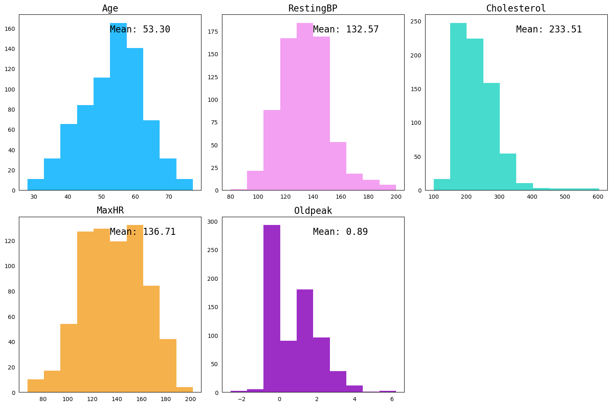

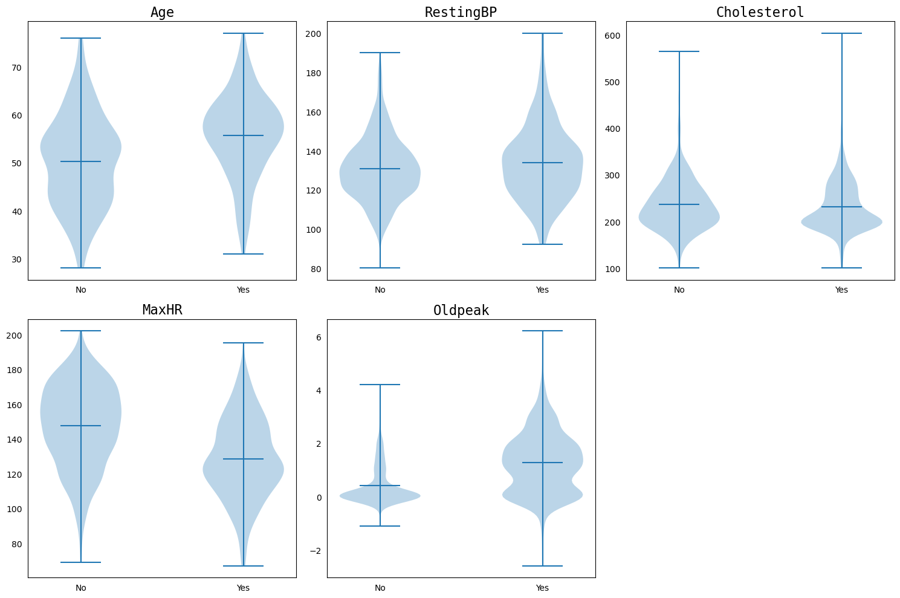

### Pre-processing: Standard-scaling, Correlation, One-hot Encoding, PCA, FAMD, and Recursive feature elimination with CV

As each of our numerical variables are on a different scale, we first standardize our data using the `StandardScaler` from `sklearn`. Then we can look at the correlations in our numerical features and visualize with a heatmap:

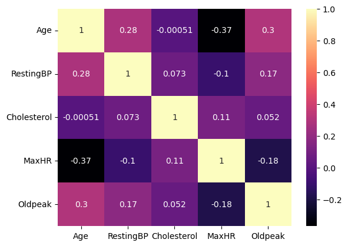

For categorical columns we simply use stacked bar charts:

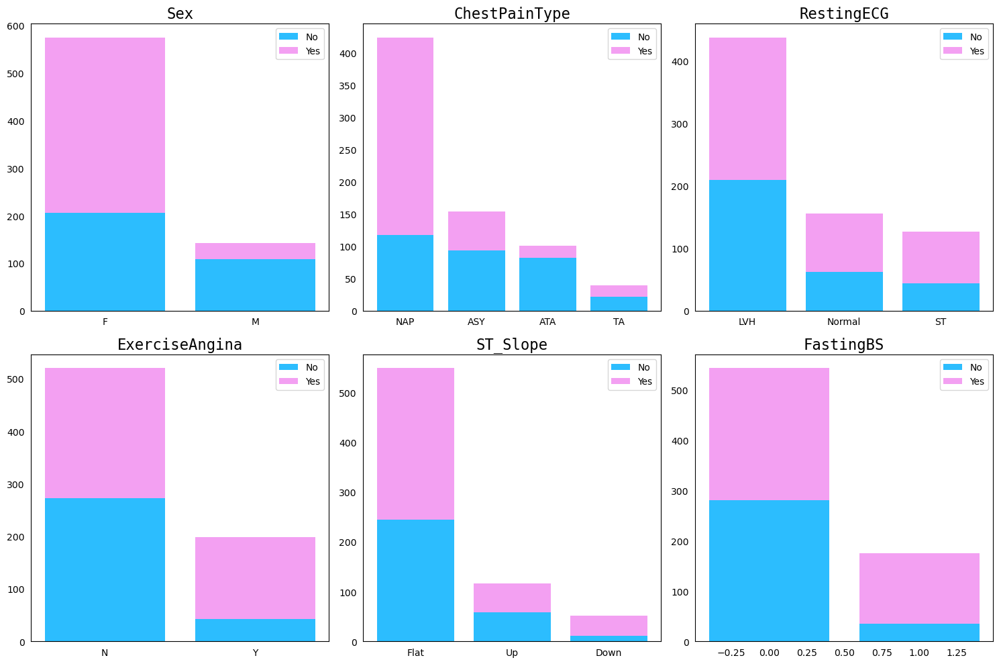

As we can see from above, none of the variables are very strongly correlated with each other. There seem to be a negative correlation between `age` and `MaxHR`, and positive correlation between `age` and `Oldpeak`.

To convert our categorical columns into more easily analyzable values, we apply One-hot encoding to those columns, and then we perform PCA and visualize the first two eigenvectors:

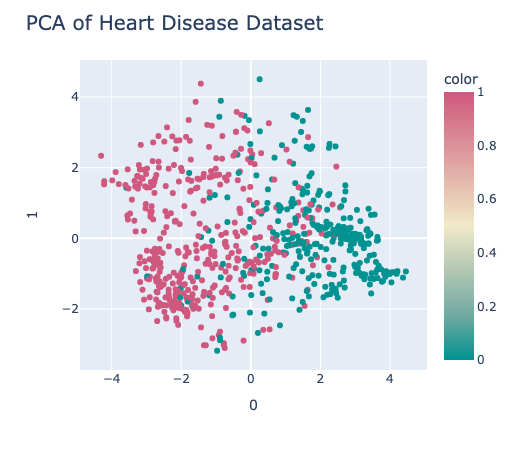

* How many significant signals exist in the independent variables?

After PCA, we can calculate the number of components that account for 90% of the variance, and here is the result:
    The number of principal components to explain 90% of the variance is 12

FAMD (factor analysis of mixed data) analysis is a great way to handle mixed data features, it is essentially a mix between PCA and multiple correspondence analysis, where it takes into account the correlation for both quantitative and qualitative variables. Here is our results:

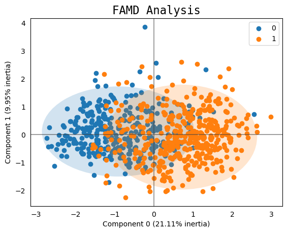

As we can see, this produced slightly between separation between the two targets than PCA alone.

Another way to further eliminate features is with recursive feature elimination with cross validation. Here, we use a logistic regression model as our estimator and we can select features based on accuracy scores from cross-validation.

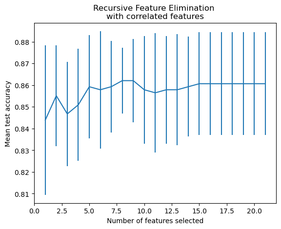

So now that we have transformed our data into 8 dimensions given the results from feature elimination, we can begin our classification tasks.

## Classification

We will be using the following classifiers for our task:

* *Support Vector Machine*: find a hyperplane that separates different classes, here we are using the radial basis kernel function with regularization C=1.2, and default parameters for the rest.
* *Random forest*: an ensemble method that creates a group of decision trees where the final output is a combination of predictions from each tree. We limit the max depth to 100, number of estimators to 100, and use entropy as our criteria for splitting.
* *Gradient Boosting*: another ensemble algorithm where decision trees are created sequentially, and final output is a result of outputs through the pipeline of trees. We define max depth to be 2 and learning rate to be 0.2, and use Friedman MSE for measuring the quality of splits.
* *XGBoost*: this is an optimized implementation of Gradient Boosting, as it uses several techniques to improve the GB algorithm including parallel processing and regularization. We apply a learning rate of 0.2 and set the max depth of trees to be 4.
* *MLP*: artificial neural network that leverages multiple layers of interconnected nodes with an activation function. Here we are using 3 hidden layers of 20 nodes and set the max iteration to be 100. 

Here are the result reports for each method:

    SVM accuracy: 0.861

                precision    recall  f1-score   support

            0       0.91      0.76      0.83        63
            1       0.84      0.94      0.88        81
        accuracy                        0.86       144
    macro avg       0.87      0.85      0.86       144
    weighted avg    0.87      0.86      0.86       144

    RF accuracy: 0.840

                precision    recall  f1-score   support

            0       0.88      0.73      0.80        63
            1       0.82      0.93      0.87        81
        accuracy                        0.84       144
    macro avg       0.85      0.83      0.83       144
    weighted avg    0.85      0.84      0.84       144

    GB accuracy: 0.833

                precision    recall  f1-score   support

            0       0.88      0.71      0.79        63
            1       0.81      0.93      0.86        81
        accuracy                        0.83       144
    macro avg       0.84      0.82      0.83       144

    weighted avg       0.84      0.83      0.83       144
    
    MLP accuracy: 0.875

                precision    recall  f1-score   support

            0       0.89      0.81      0.85        63
            1       0.86      0.93      0.89        81
        accuracy                        0.88       144
    macro avg       0.88      0.87      0.87       144
    weighted avg    0.88      0.88      0.87       144

    XGBoost accuracy: 0.847

                precision    recall  f1-score   support

            0       0.89      0.75      0.81        63
            1       0.82      0.93      0.87        81
        accuracy                        0.85       144
    macro avg       0.86      0.84      0.84       144
    weighted avg    0.85      0.85      0.85       144

## Evaluation

For evaluating our classifiers, we can compute the confusion matrix, F1 score, bias and variance for each classifier. To best predict bias and variance, we use bias variance decomposition. The results are as follows:

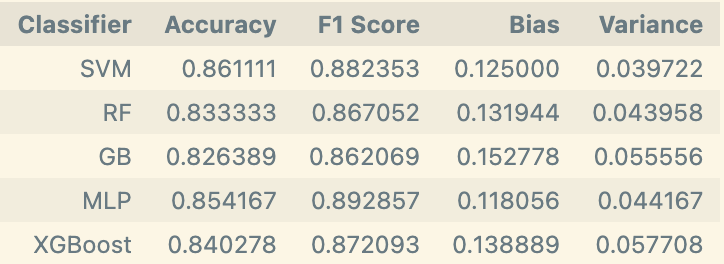

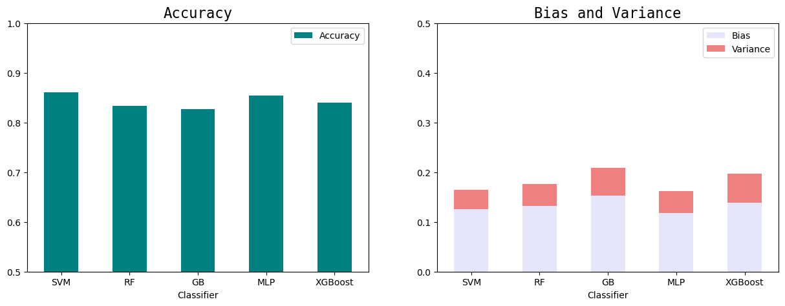

    SVM confusion matrix:

    [[49 14]

    [ 6 75]]

    RF confusion matrix:

    [[46 17]

    [ 6 75]]

    GB confusion matrix:

    [[45 18]

    [ 6 75]]

    MLP confusion matrix:

    [[51 12]

    [ 6 75]]

    XGBoost confusion matrix:

    [[47 16]

    [ 6 75]]

We can also plot the ROC curves for SVM and GB classifiers and calculate their AUC(area under curve):

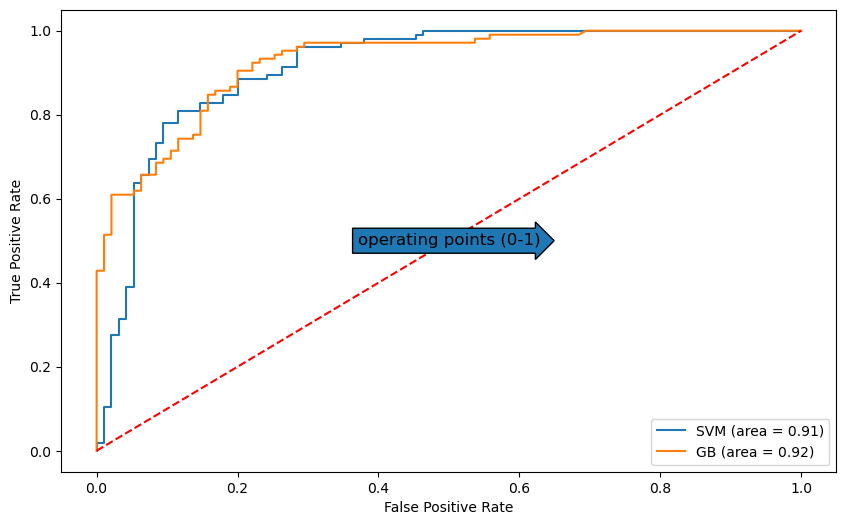

Based on the accuracy and F1 score, SVM and ML performed best, they also both had the least bias and variance. Looking at the ROC and AUC for SVM and gradient boosting, the two models are fairly comparable, but since SVM has a better accuracy, we would pick SVM as the current best classifier. And a good operating point for these two models would maximize TP rate and minimize FP rate, which are around 0.85 and 0.3, respectively.

Looking at the bias and variance, each model has relatively low variance but the three tree based classifiers seem to have higher bias. This means that we should increase the power of the models.

## Iteration

Now, let's see if we can make our random forest classifier better - first, we can take a look at the current hyper-parameters:

    {'bootstrap': True, 'ccp_alpha': 0.0, 'class_weight': None, 'criterion': 'entropy', 'max_depth': 100, 'max_features': 'auto', 'max_leaf_nodes': None, 'max_samples': None, 'min_impurity_decrease': 0.0, 'min_samples_leaf': 1, 'min_samples_split': 2, 'min_weight_fraction_leaf': 0.0, 'n_estimators': 100, 'n_jobs': None, 'oob_score': False, 'random_state': 42, 'verbose': 0, 'warm_start': False}

First, we can use a random search cross validation to explore different hyperparameter combinations like the following:

    hyperparameters = {
        'bootstrap': [True, False],
        'n_estimators': [100, 200, 300, 400, 500, 600, 700, 800, 900, 1000, 1200, 1400, 1600, 1800, 2000],
        'max_depth': [5, 10, 15, 20, 25, 50, 75, 100, None],
        'min_samples_split': [2, 5, 10, 15, 20],
        'min_samples_leaf': [1, 2, 4],
        'max_features': ['auto', 'sqrt', 'log2'],
        'criterion': ['gini', 'entropy'],
        }

Here is the classification report for our randomly selected best classifier:

                precision    recall  f1-score   support

            0       0.90      0.75      0.82        63

            1       0.83      0.94      0.88        81

    accuracy                           0.85       144

    macro avg       0.86      0.84      0.85       144

    weighted avg       0.86      0.85      0.85       144

And the best parameters are:

    {'n_estimators': 200, 'min_samples_split': 10, 'min_samples_leaf': 4, 'max_features': 'auto', 'max_depth': 50, 'criterion': 'gini', 'bootstrap': True}

Now that we have reduced our search space, we can define a smaller set of hyper-parameters and use grid search. 

    hyperparameters_grid = {
    'bootstrap': [True],
    'n_estimators': [100, 200, 300],
    'max_depth': [30, 50, 70],
    'min_samples_split': [5, 10, 15],
    'min_samples_leaf': [1, 2, 4, 6],
    'max_features': ['auto'],
    'criterion': ['gini'],
    }

Though accuracy remained the same, the final best parameters are:

    {'bootstrap': True, 'criterion': 'gini', 'max_depth': 30, 'max_features': 'auto', 'min_samples_leaf': 6, 'min_samples_split': 5, 'n_estimators': 100}

Another way to look at the accuracies of our Random Forest classifier is to perform K fold cross validation:

    Random Forest accuracy: 0.854 +/- 0.023

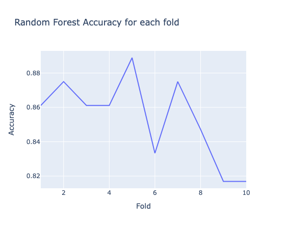

## Reflection

In this project, we explored using different pre-processing methods for data, and applied a variety of classic machine learning algorithms for the classification task; we also compared and evaluated the different models and attempted to tune and improve the classifiers. Here are some takeaways:

* For data with both numerical and categorical features, one can apply methods including one-hot encoding and FAMD for feature selection.
* Some of the most important metrics to evaluate models include accuracy, F1 score, bias and variance.
* Split the training data into training and validation sets for tuning
* Cross validation is a great tool for both hyper-parameter tuning and model evaluation

## Extensions

* Implemented additional ML algorithms for classification
* Learned and applied FAMD for component analysis for combined qualitative and quantitative data
* Used random and grid search for iterating through different hyperparameters for tuning the model
* Generated 2 ROC curves and calculated AUC

## References
1. https://www.kaggle.com/code/jiagengchang/heart-disease-multiple-correspondence-analysis/notebook
2. https://en.wikipedia.org/wiki/Pearson_correlation_coefficient
3. https://towardsdatascience.com/famd-how-to-generalize-pca-to-categorical-and-numerical-data-2ddbeb2b9210
4. https://towardsdatascience.com/factor-analysis-of-mixed-data-5ad5ce98663c
5. https://scikit-learn.org/stable/auto_examples/feature_selection/plot_rfe_with_cross_validation.html#sphx-glr-auto-examples-feature-selection-plot-rfe-with-cross-validation-py
6. https://pub.towardsai.net/bias-variance-decomposition-101-a-step-by-step-computation-9d5f3694877
7. https://www.bmc.com/blogs/bias-variance-machine-learning/
8. https://towardsdatascience.com/the-bias-variance-tradeoff-8818f41e39e9
9. https://towardsdatascience.com/hyperparameter-tuning-the-random-forest-in-python-using-scikit-learn-28d2aa77dd74
10. https://medium.com/@data.science.enthusiast/auc-roc-curve-ae9180eaf4f7
11. https://medium.com/@outside2SDs/an-overview-of-correlation-measures-between-categorical-and-continuous-variables-4c7f85610365