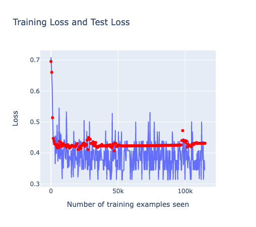

# Project 4: Introduction to Deep Learning

## Dependencies
This project has the following requirements:

    pandas
    matplotlib
    plotly
    numpy
    torch
    torchvision
    ray[tune]
    scikit-learn

## Setup and Running Executables

All analysis in this project are conducted in either Jupyter Notebooks or using Python scripts. Tuning hyper-parameters and training models are done using Ray Tune, which can be installed using `pip install ray[tune]`.

Of note, some of the deep network training are done with M1 GPU acceleration, which may not be available on other machines. If you are using a different machine, you may need to change the device to `cpu` in the code.

The PDF report for this project is created from README.md using

    pandoc README.md -o project4_report.pdf "-fmarkdown-implicit_figures -o"
    --from=markdown -V geometry:margin=.8in --toc --highlight-style=espresso

## Description

In this project, we begin using deep learning to solve a few classification problems with PyTorch. We explore different deep network architectures, other hyper-parameters, as well as using transfer learning to perform new tasks based on a pre-trained model.

## 1. MNIST Tutorial

In this section, we have implemented the tutorial for working with MNIST data and trained a model for classification handwritten letters.

This is the network architecture used:

    Net(
    (conv1): Conv2d(1, 10, kernel_size=(5, 5), stride=(1, 1))
    (conv2): Conv2d(10, 20, kernel_size=(5, 5), stride=(1, 1))
    (conv2_drop): Dropout2d(p=0.5, inplace=False)
    (fc1): Linear(in_features=320, out_features=50, bias=True)
    (fc2): Linear(in_features=50, out_features=10, bias=True)
    )
    torch.Size([10, 1, 5, 5])
    torch.Size([10])
    torch.Size([20, 10, 5, 5])
    torch.Size([20])
    torch.Size([50, 320])
    torch.Size([50])
    torch.Size([10, 50])
    torch.Size([10])

Here are some example outputs and predictions:

We can visualize our training and test loss:

To further improve our network, we can also perform continued training, where we load model states that were saved during the first training. Here are the additional results:

## 2. Experiment with Network Variations

### Developing a Plan

* Train with default config to get baseline results
* Separate our data into training, validation and test sets
* Define search configs for hyper-parameters and set up pipelines
* Search through combinations with Ray Tune
* Evaluate and present the best model configs

### Predict the Results

Currently, our accuracy is only 82%. This means that we need to train a more powerful network with more epochs. We predict that as we increase the number of convolution layers and the size of the fully connected layers, we will get better performance.

### Results and Evaluation

Using `config`, we define the search space for our hyper-parameters. We can then use `tune.run` to search through the combinations of hyper-parameters. We can also use `tune.run` to train our model with the best hyper-parameters.

    config = {
            "nn": tune.choice(["c1", "c2", "c3", "c4", "c5", "c6"]),
            "l1": tune.sample_from(lambda _: 2**np.random.randint(2, 9)),
            "l2": tune.sample_from(lambda _: 2**np.random.randint(2, 9)),
            "lr": tune.loguniform(1e-4, 1e-1),
            "batch_size": tune.choice([8, 16, 32, 64])
        }

Using Ray Tune, we have trained a few different models with different hyper-parameters by random search through the configuration space. Using Tensorboard, we were able to visualize each model and upload the results to Tensorboard.dev. 

Here is the result output from Ray Tune:

    Number of trials: 50/50 (50 TERMINATED)
    +--------------------------+------------+-----------------+--------------+------+------+-------------+------+------------+------------+----------------------+
    | Trial name               | status     | loc             |   batch_size |   l1 |   l2 |          lr | nn   |       loss |   accuracy |   training_iteration |
    |--------------------------+------------+-----------------+--------------+------+------+-------------+------+------------+------------+----------------------|
    | train_fmnist_66f43_00000 | TERMINATED | 127.0.0.1:39054 |           16 |   16 |  256 | 0.00206247  | c3   |   0.8076   |  0.68625   |                   10 |
    | train_fmnist_66f43_00001 | TERMINATED | 127.0.0.1:39054 |            8 |   32 |  256 | 0.0206503   | c1   |   1.84822  |  0.282917  |                    1 |
    | train_fmnist_66f43_00002 | TERMINATED | 127.0.0.1:39054 |           16 |   64 |   16 | 0.00197529  | c5   |   0.44979  |  0.843     |                   10 |
    | train_fmnist_66f43_00003 | TERMINATED | 127.0.0.1:39054 |           16 |    4 |  128 | 0.00258987  | c6   |   1.62764  |  0.358583  |                    1 |
    | train_fmnist_66f43_00004 | TERMINATED | 127.0.0.1:39054 |           64 |    4 |   32 | 0.0674501   | c3   |   1.73747  |  0.303917  |                    1 |
    | train_fmnist_66f43_00005 | TERMINATED | 127.0.0.1:39054 |            8 |   32 |   32 | 0.00062723  | c5   |   0.53378  |  0.803833  |                   10 |
    | train_fmnist_66f43_00006 | TERMINATED | 127.0.0.1:39054 |           16 |   16 |   64 | 0.0011763   | c3   |   0.966107 |  0.615917  |                    2 |
    | train_fmnist_66f43_00007 | TERMINATED | 127.0.0.1:39054 |           16 |  128 |    8 | 0.0114439   | c6   |   0.486539 |  0.827083  |                   10 |
    | train_fmnist_66f43_00008 | TERMINATED | 127.0.0.1:39054 |            8 |   32 |    8 | 0.00626231  | c3   |   0.800498 |  0.705     |                    2 |
    | train_fmnist_66f43_00009 | TERMINATED | 127.0.0.1:39054 |            8 |    8 |   32 | 0.000363216 | c6   |   1.43776  |  0.412333  |                    1 |
    | train_fmnist_66f43_00010 | TERMINATED | 127.0.0.1:39054 |           16 |   32 |   16 | 0.0612799   | c7   | nan        |  0.1015    |                   10 |
    | train_fmnist_66f43_00011 | TERMINATED | 127.0.0.1:39054 |           32 |  128 |  128 | 0.00664651  | c7   |   0.401821 |  0.85575   |                   10 |
    | train_fmnist_66f43_00012 | TERMINATED | 127.0.0.1:39054 |            8 |   32 |  256 | 0.00189866  | c2   |   0.626905 |  0.762417  |                    4 |
    | train_fmnist_66f43_00013 | TERMINATED | 127.0.0.1:39054 |           64 |   32 |   16 | 0.000883322 | c4   |   1.2821   |  0.49525   |                    1 |
    | train_fmnist_66f43_00014 | TERMINATED | 127.0.0.1:39054 |           32 |   32 |   16 | 0.00215716  | c3   |   0.788021 |  0.711333  |                    2 |
    | train_fmnist_66f43_00015 | TERMINATED | 127.0.0.1:39054 |           64 |   64 |  128 | 0.0300275   | c5   |   0.482543 |  0.823833  |                   10 |
    | train_fmnist_66f43_00016 | TERMINATED | 127.0.0.1:39054 |            8 |  128 |    4 | 0.0139086   | c6   |   1.01089  |  0.656417  |                    2 |
    | train_fmnist_66f43_00017 | TERMINATED | 127.0.0.1:39054 |            8 |  128 |   32 | 0.000394455 | c8   |   0.566913 |  0.797667  |                    4 |
    | train_fmnist_66f43_00018 | TERMINATED | 127.0.0.1:39054 |           64 |    8 |  256 | 0.000668037 | c5   |   2.15341  |  0.197333  |                    1 |
    | train_fmnist_66f43_00019 | TERMINATED | 127.0.0.1:39054 |           32 |   32 |   16 | 0.000156712 | c5   |   2.30065  |  0.12575   |                    1 |
    | train_fmnist_66f43_00020 | TERMINATED | 127.0.0.1:39054 |           64 |   32 |   64 | 0.00976354  | c7   |   0.634556 |  0.770667  |                    4 |
    | train_fmnist_66f43_00021 | TERMINATED | 127.0.0.1:39054 |           64 |  256 |    4 | 0.0684767   | c4   |   0.728554 |  0.717667  |                    2 |
    | train_fmnist_66f43_00022 | TERMINATED | 127.0.0.1:39054 |           16 |   64 |  128 | 0.00262746  | c6   |   0.418936 |  0.846083  |                   10 |
    | train_fmnist_66f43_00023 | TERMINATED | 127.0.0.1:39054 |           16 |    4 |   64 | 0.00863927  | c8   |   1.60442  |  0.410417  |                    1 |
    | train_fmnist_66f43_00024 | TERMINATED | 127.0.0.1:39054 |            8 |   64 |   16 | 0.0361757   | c4   |   2.31575  |  0.102583  |                    1 |
    | train_fmnist_66f43_00025 | TERMINATED | 127.0.0.1:39054 |           64 |  128 |  256 | 0.00267729  | c3   |   0.706901 |  0.739833  |                    2 |
    | train_fmnist_66f43_00026 | TERMINATED | 127.0.0.1:39054 |           64 |    4 |   32 | 0.000110058 | c5   |   2.2941   |  0.117667  |                    1 |
    | train_fmnist_66f43_00027 | TERMINATED | 127.0.0.1:39054 |            8 |    8 |  256 | 0.00289519  | c7   |   1.30036  |  0.48775   |                    1 |
    | train_fmnist_66f43_00028 | TERMINATED | 127.0.0.1:39054 |           64 |    8 |   64 | 0.00215591  | c7   |   1.47626  |  0.39725   |                    1 |
    | train_fmnist_66f43_00029 | TERMINATED | 127.0.0.1:39054 |            8 |   64 |  128 | 0.0629795   | c2   |   2.32073  |  0.0994167 |                    1 |
    | train_fmnist_66f43_00030 | TERMINATED | 127.0.0.1:39054 |           16 |  128 |  256 | 0.0196399   | c3   |   0.745652 |  0.730583  |                    2 |
    | train_fmnist_66f43_00031 | TERMINATED | 127.0.0.1:39054 |            8 |    4 |   16 | 0.0237702   | c4   |   1.95393  |  0.281333  |                    1 |
    | train_fmnist_66f43_00032 | TERMINATED | 127.0.0.1:39054 |           32 |   64 |   64 | 0.0125313   | c4   |   0.565214 |  0.803917  |                    4 |
    | train_fmnist_66f43_00033 | TERMINATED | 127.0.0.1:39054 |           16 |  128 |  256 | 0.0542981   | c3   |   1.95289  |  0.266333  |                    1 |
    | train_fmnist_66f43_00034 | TERMINATED | 127.0.0.1:39054 |           32 |    8 |   32 | 0.00667866  | c7   |   1.28037  |  0.490167  |                    1 |
    | train_fmnist_66f43_00035 | TERMINATED | 127.0.0.1:39054 |           64 |    4 |    4 | 0.0639286   | c3   |   1.70421  |  0.28875   |                    1 |
    | train_fmnist_66f43_00036 | TERMINATED | 127.0.0.1:39054 |            8 |  128 |   32 | 0.00275755  | c2   |   0.451571 |  0.8375    |                   10 |
    | train_fmnist_66f43_00037 | TERMINATED | 127.0.0.1:39054 |           64 |  128 |    4 | 0.000795191 | c7   |   1.34383  |  0.485917  |                    1 |
    | train_fmnist_66f43_00038 | TERMINATED | 127.0.0.1:39054 |           32 |   64 |   64 | 0.000101874 | c6   |   2.28555  |  0.145083  |                    1 |
    | train_fmnist_66f43_00039 | TERMINATED | 127.0.0.1:39054 |           16 |    8 |  128 | 0.0165327   | c3   |   1.60055  |  0.35675   |                    1 |
    | train_fmnist_66f43_00040 | TERMINATED | 127.0.0.1:39054 |           32 |    4 |    4 | 0.000576219 | c5   |   2.07202  |  0.157417  |                    1 |
    | train_fmnist_66f43_00041 | TERMINATED | 127.0.0.1:39054 |           64 |   32 |   64 | 0.00155077  | c8   |   0.989475 |  0.63425   |                    2 |
    | train_fmnist_66f43_00042 | TERMINATED | 127.0.0.1:39054 |            8 |   32 |  256 | 0.000518675 | c1   |   0.709861 |  0.73625   |                    2 |
    | train_fmnist_66f43_00043 | TERMINATED | 127.0.0.1:39054 |           32 |   64 |    8 | 0.0157333   | c7   |   0.511675 |  0.820583  |                    8 |
    | train_fmnist_66f43_00044 | TERMINATED | 127.0.0.1:39054 |           16 |   16 |   32 | 0.000467206 | c1   |   1.01289  |  0.596     |                    2 |
    | train_fmnist_66f43_00045 | TERMINATED | 127.0.0.1:39054 |           64 |  256 |  256 | 0.00130333  | c1   |   0.71153  |  0.723     |                    2 |
    | train_fmnist_66f43_00046 | TERMINATED | 127.0.0.1:39054 |           64 |  256 |    8 | 0.0199584   | c5   |   0.391987 |  0.85825   |                   10 |
    | train_fmnist_66f43_00047 | TERMINATED | 127.0.0.1:39054 |           16 |    8 |    8 | 0.00036141  | c6   |   1.54092  |  0.366583  |                    1 |
    | train_fmnist_66f43_00048 | TERMINATED | 127.0.0.1:39054 |            8 |   64 |   16 | 0.00333754  | c4   |   0.565964 |  0.779583  |                    4 |
    | train_fmnist_66f43_00049 | TERMINATED | 127.0.0.1:39054 |           16 |    8 |    8 | 0.000220345 | c3   |   1.8277   |  0.292833  |                    1 |
    +--------------------------+------------+-----------------+--------------+------+------+-------------+------+------------+------------+----------------------+

    2023-03-16 20:55:13,511 INFO tune.py:798 -- Total run time: 6493.39 seconds (6493.35 seconds for the tuning loop).
    Best trial config: {'nn': 'c5', 'l1': 256, 'l2': 8, 'lr': 0.019958412992905763, 'batch_size': 64}
    Best trial final validation loss: 0.3919870887506515
    Best trial final validation accuracy: 0.85825

    Best trial test set accuracy: 0.8536

Full results can be found on Tensorboard.dev at https://tensorboard.dev/experiment/WgVGNysDQBa5PrkOY8Tn2w/ .

From this experiment, we can see that the best model is a 5-layer network with 3 convolution layers and 2 fully connected layers with 256 units in the first layer, 8 units in the second layer, and a learning rate of 0.0199. The best model achieves a test accuracy of 0.8536, which is slightly better than our baseline model. One can imagine that as we increase the number of convolution layers we may be able to achieve even better results.

## 3. Transfer Learning on Greek Letters

Next, we will use transfer learning to train a model to classify Greek letters. We will use the pre-trained model from part 1 and modify the last layer to classify the Greek letters.

First, we can visualize the greek letters after transformation:

Here is the structure of the modified network:

    Net(
    (conv1): Conv2d(1, 10, kernel_size=(5, 5), stride=(1, 1))
    (conv2): Conv2d(10, 20, kernel_size=(5, 5), stride=(1, 1))
    (conv2_drop): Dropout2d(p=0.5, inplace=False)
    (fc1): Linear(in_features=320, out_features=50, bias=True)
    (fc2): Linear(in_features=50, out_features=3, bias=True)
    )
    torch.Size([10, 1, 5, 5])
    torch.Size([10])
    torch.Size([20, 10, 5, 5])
    torch.Size([20])
    torch.Size([50, 320])
    torch.Size([50])
    torch.Size([3, 50])
    torch.Size([3])

Here are some example outputs and predictions:

Now, we can visualize our training loss: it took about 200 epochs to reach an almost perfect accuracy.

## 4. Heart Disease Prediction Using an ANN

Now that we have had some practice with PyTorch, we will use it to predict heart disease using the heart disease data from the last project where we implement an ANN with linear layers. 

### The Networks

For making predictions on the heart disease data, we will experiment with two different network architectures and compare their performance. The first network has one hidden layer with 30 nodes and the second network has two hidden layers with 5 and 10 nodes each. We will use ReLU activation functions for both networks. We will also use the Adam optimizer with a learning rate of 0.01 and train both networks for 200 epochs.

    LinearNN(
    (fc1): Linear(in_features=12, out_features=30, bias=True)
    (activation): ReLU()
    (fc2): Linear(in_features=30, out_features=2, bias=True)
    (softmax): Softmax(dim=None)
    )
    torch.Size([30, 12])
    torch.Size([30])
    torch.Size([2, 30])
    torch.Size([2])

    LinearNN(
    (fc1): Linear(in_features=12, out_features=5, bias=True)
    (activation): ReLU()
    (fc2): Linear(in_features=5, out_features=10, bias=True)
    (fc3): Linear(in_features=10, out_features=2, bias=True)
    (softmax): Softmax(dim=None)
    )
    torch.Size([5, 12])
    torch.Size([5])
    torch.Size([10, 5])
    torch.Size([10])
    torch.Size([2, 10])
    torch.Size([2])

### Computational Requirements and Performance

Comparing the number of parameters in each network, we can see that the first network has 452 parameters while the second network has 147 parameters. This means that the first network is more powerful and will require more computational resources to train. However, the second network will be faster to train and will require less memory.

Interestingly, the first network has a higher accuracy than the second network. This is likely because the first network has more parameters and is therefore more powerful. The training time for the first network on the author's machine is 10.8s vs. 19.4s for the second network - we suspect that this is due to the difference in the optimizer SGD vs. Adam.

In comparing the efficiency of the training process, it is clear that the second network is more efficient. 

*Model 1*

    Number of parameters: 452
    Training time: 10.8s
    Accuracy: 0.82

*Model 2*

    Number of parameters: 147
    Training time: 19.4s
    Accuracy: 0.79

We can also see that 200 epoch is probably too many for this dataset. Interestingly, ADAM optimizer was able to reduce the training loss much faster than the SGD optimizer.

## Extensions

1. Transfer learning tutorial is implemented in `project4_extension.ipynb`.
2. Explored additional tuning methods and hyper-parameters in part 2.

## Reflections

* PyTorch is a powerful tool for building neural networks. It seems easy to use while still being flexible enough to build complex models.
* It takes time to understand the different functions in PyTorch and how to use them. The tutorials are very helpful for this.
* Without very much experience, it was challenging to choose the right hyper-parameters for the models. Though experimenting with Ray Tune was very helpful automating the search through the configuration space.
* Transfer learning seems extremely useful for building a network for more sophisticated tasks with less data and reduced training time. 
* Using M1 GPU acceleration significantly reduced the training time for some of the tasks while it caused the kernel to crash in others.
* Tensorboard is great for visualizing tuning results with the ability to upload it to Tensorboard.dev.

## References
1. https://towardsdatascience.com/hyperparameter-tuning-of-neural-networks-with-optuna-and-pytorch-22e179efc837
2. https://machinelearningmastery.com/choose-an-activation-function-for-deep-learning/
3. https://dingyan89.medium.com/calculating-parameters-of-convolutional-and-fully-connected-layers-with-keras-186590df36c6#:~:text=The%20kernel%20size%20of%20max,5%2C5%2C16
4. https://towardsdatascience.com/hyperparameter-tuning-of-neural-networks-with-optuna-and-pytorch-22e179efc837
5. https://shashikachamod4u.medium.com/excel-csv-to-pytorch-dataset-def496b6bcc1
6. https://pytorch.org/tutorials/beginner/hyperparameter_tuning_tutorial.html
7. https://pytorch.org/tutorials/beginner/basics/data_tutorial.html
8. https://machinelearningmastery.com/adam-optimization-algorithm-for-deep-learning/
9. https://tensorboard.dev/#add-name-description-to-experiment
10. https://pytorch.org/tutorials/beginner/basics/data_tutorial.html
11. https://towardsdatascience.com/installing-pytorch-on-apple-m1-chip-with-gpu-acceleration-3351dc44d67c
12. https://docs.ray.io/en/latest/ray-overview/getting-started.html
13. https://machinelearningmastery.com/adam-optimization-algorithm-for-deep-learning/
