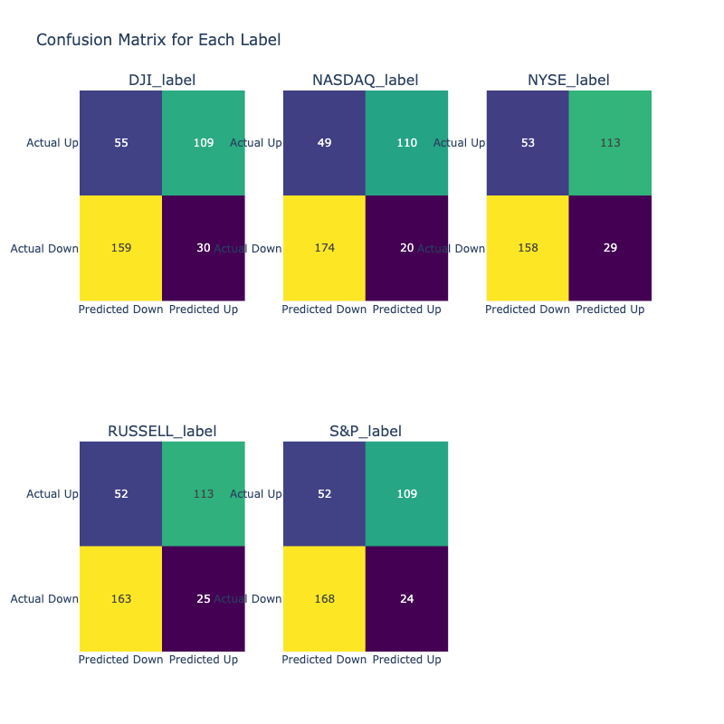
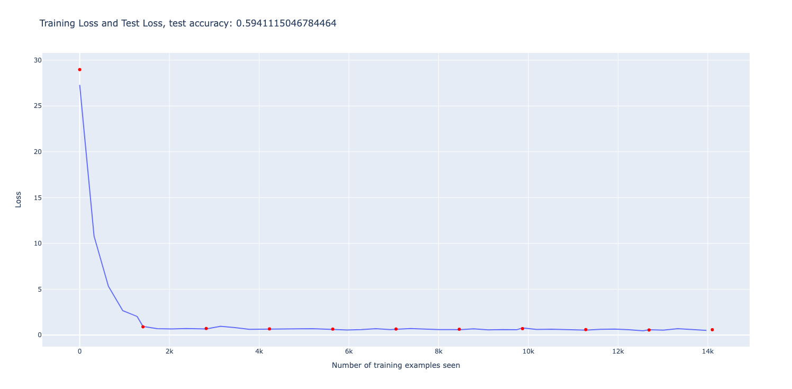
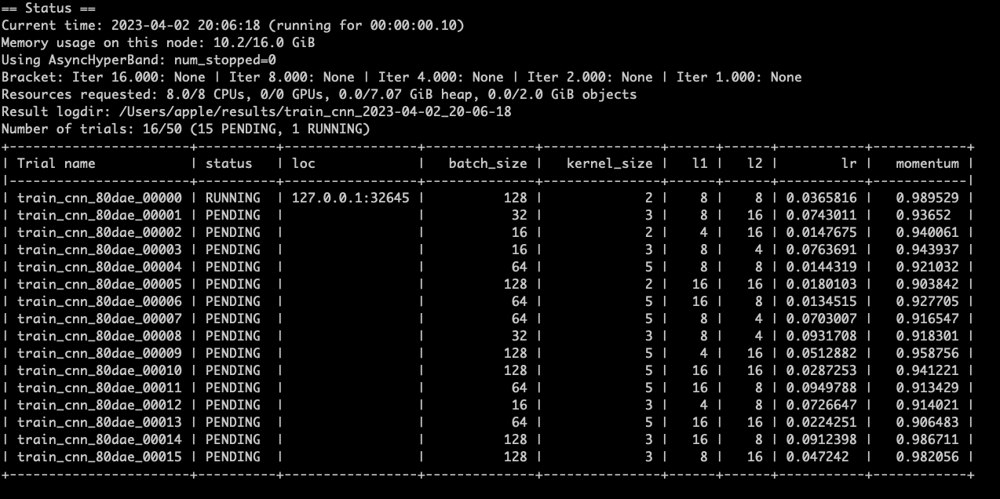
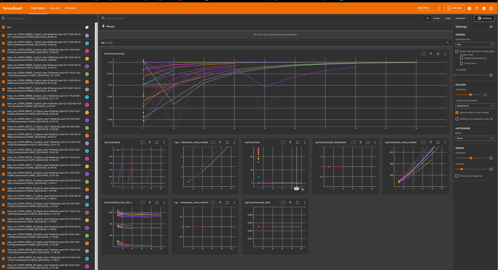

# Project 5: Going further with Deep Learning

## Dependencies

This project has the following requirements:

    pandas
    matplotlib
    plotly
    numpy
    torch
    torchvision
    ray[tune]
    scikit-learn
    tensorboard

## Setup and Running Executables

All analysis in this project are conducted in either Jupyter Notebooks or using Python scripts. Tuning hyper-parameters and training models are done using Ray Tune, which can be installed using `pip install ray[tune]`.

The PDF report for this project is created from README.md using

    pandoc README.md -o project5_report.pdf "-fmarkdown-implicit_figures -o"
    --from=markdown -V geometry:margin=.8in --toc --highlight-style=espresso

## 1. Organize Data by Day 1 Prediction

The first step is to organize the data by day 1 predciton. This is done by the following steps:

* Fill in missing values using the median of each column
* Concatenate the data for each stock index into one dataframe
* Split the data into training and testing sets, using data before 2017 for training and data after 2017 for testing

The script for this step is in [`organize_data.py`](utils/organize_data.py).

## 2. Implement two ML methods for 1-day binary prediction

For the prediction, we decided to define the task as multi-label classification where the model predicts whether each stock index goes up or down at the same time. This means that we will need networks that support outputting multiple labels.

To get a baseline model performance, we will implement two ML methods for 1-day binary prediction: random forest classifier using `sklearn` and a linear neural network using `pytorch`. Random forest classifiers are one of the highest performing ensemble methods and are often used as a baseline model for classification tasks. The linear neural network is a simple model that can be used as a baseline for more complex models. We also preprocess the data using PCA to reduce the dimensionality of the data and the number of principal components is chosen using the MLE (Maximum Likelihood) algorithm to ensure optimal number of dimensions.

### 2.1 Random Forest Classifier Results

Analysis and training using random forest is in the notebook [`project5.ipynb`](project5.ipynb). Surprisingly, the random forest classifier performed well achieving 0.6 accuracy fro the validation set. The classification report and confusion matrix for the random forest classifier is shown below:

                precision    recall  f1-score   support

        DJI_label       0.78      0.66      0.72       164
    NASDAQ_label       0.85      0.69      0.76       159
    NYSE_label       0.80      0.68      0.73       166
    RUSSELL_label       0.82      0.68      0.75       165
        S&P_label       0.82      0.68      0.74       161

        micro avg       0.81      0.68      0.74       815
        macro avg       0.81      0.68      0.74       815
    weighted avg       0.81      0.68      0.74       815
    samples avg       0.34      0.35      0.33       815

### 2.2 Linear Neural Network Results

Now we will build an ANN in `pytorch` to perform the same task. The network architecture is shown below, we have defined 3 fully connected layers and a sigmoid activation function for the output layer. Of note, we choose the sigmoid activation function for the output layer because we are performing multi-label classification. The sigmoid activation function is used to output a probability between 0 and 1 for each label. The network is trained for 10 epochs and had a similar accuracy of 0.59. The training loss curve is as follows:

    StockLinearNN(
    (fc1): LazyLinear(in_features=0, out_features=3, bias=True)
    (activation): ReLU()
    (fc2): Linear(in_features=3, out_features=3, bias=True)
    (fc3): Linear(in_features=3, out_features=5, bias=True)
    (sigmoid): Sigmoid()
    )

The network is trained using the Adam optimizer and the cross entropy loss function. The network is trained for 10 epochs and had a similar accuracy of 0.59. The training loss curve is as follows:

## 3, 4. Prediction using 60 days of data and 2D CNN

For this part, we will use a 2D CNN to predict the stock index movement. We have defined a `Dataset` where it dynamics outputs a 60 day window of data for each stock index. We have defined the general neural net structure as having 3 convolution layers and 3 fully connected layers with configurable number of nodes in the fully connected layers and kernel sizes. Here is an example of the network architecture:

    StockCNN(
    (conv1): Conv2d(1, 10, kernel_size=(5, 5), stride=(1, 1), padding=same)
    (conv2): Conv2d(10, 20, kernel_size=(5, 5), stride=(1, 1))
    (conv3): Conv2d(20, 40, kernel_size=(5, 5), stride=(1, 1))
    (conv3_drop): Dropout2d(p=0.3, inplace=False)
    (fc1): LazyLinear(in_features=0, out_features=10, bias=True)
    (activation): ReLU()
    (fc2): Linear(in_features=10, out_features=20, bias=True)
    (fc3): Linear(in_features=20, out_features=5, bias=True)
    (sigmoid): Sigmoid()
    )

For model training and hyper-parameter tuning, we chose to use `ray-tune`, an industry standard tuning library for `pytorch`. We have defined a `config` dictionary that contains the hyper-parameters that we want to tune. We have defined the following hyper-parameters to tune:

    num_samples = 50
    max_num_epochs = 20
    config = {
        "l1": tune.sample_from(lambda _: 2 ** np.random.randint(2, 5)),
        "l2": tune.sample_from(lambda _: 2 ** np.random.randint(2, 5)),
        "kernel_size": tune.choice([2, 3, 5]),
        "lr": tune.loguniform(1e-2, 1e-1),
        "momentum": tune.uniform(0.9, 0.99),
        "batch_size": tune.choice([16, 32, 64, 128]),
    }

Ray-tune has several advantages including options for parallel processing and convenient result visualization with integration of `tensorboard`. Here is what the run looks like:

Training results for models with the different configurations can be visualized by running
    
    tensorboard --logdir=results/train_cnn_2023-04-02_09-48-14

Here is a snapshot of the training results, and the full results can be found in the `results` folder as well as [here](https://tensorboard.dev/experiment/qQLDNQerRT2rHkRzCXqrmQ/) on the tensorboard server.

Perhaps counterintuitively, the models' accuracy plateaued at around 0.52 and despite having 60 days of stock data, the neural net did not perform better than the baselines in part 2. In the interest of time, the author did not perform further optimization of the CNN architecture after searching through 50 combinations, however, this does align with the findings of the original paper where the F1 score was only 0.56. It is possible that the noise of additional data is not helpful for the task of predicting stock index movement and that stock prices may be largely random and unpredictable based on only previous prices without the context of related events and real world context.

## 5. Final Project Proposal

The project proposal can be found [here](final_project_plan.pdf).

## Reflection

* Stock data is very noisy and difficult to predict. The author was surprised that the CNN did not perform better than the baselines in part 2.
* Despite deep networks being powerful tools for processing complex and high dimensional data, they are not always the best choice. In this case, the simple linear model performed better than the convolutional neural net.
* The author gained a deeper understanding of activation functions, and in particular, the sigmoid activation function for multi-label classification.

## References
1. https://scikit-learn.org/stable/modules/generated/sklearn.impute.SimpleImputer.html
2. https://medium.com/@terenceshin/all-machine-learning-algorithms-you-should-know-for-2023-843dba11419c
3. https://scikit-learn.org/stable/modules/model_evaluation.html#multilabel-confusion-matrix
4. https://scikit-learn.org/stable/modules/generated/sklearn.pipeline.Pipeline.html
5. https://scikit-learn.org/stable/modules/generated/sklearn.decomposition.PCA.html
6. https://towardsdatascience.com/multilabel-classification-with-pytorch-in-5-minutes-a4fa8993cbc7
7. https://towardsdatascience.com/designing-your-neural-networks-a5e4617027ed
8. Minka, Thomas P.. “Automatic Choice of Dimensionality for PCA.” NIPS (2000).
9. https://www.projectpro.io/recipes/optimize-function-adam-pytorch